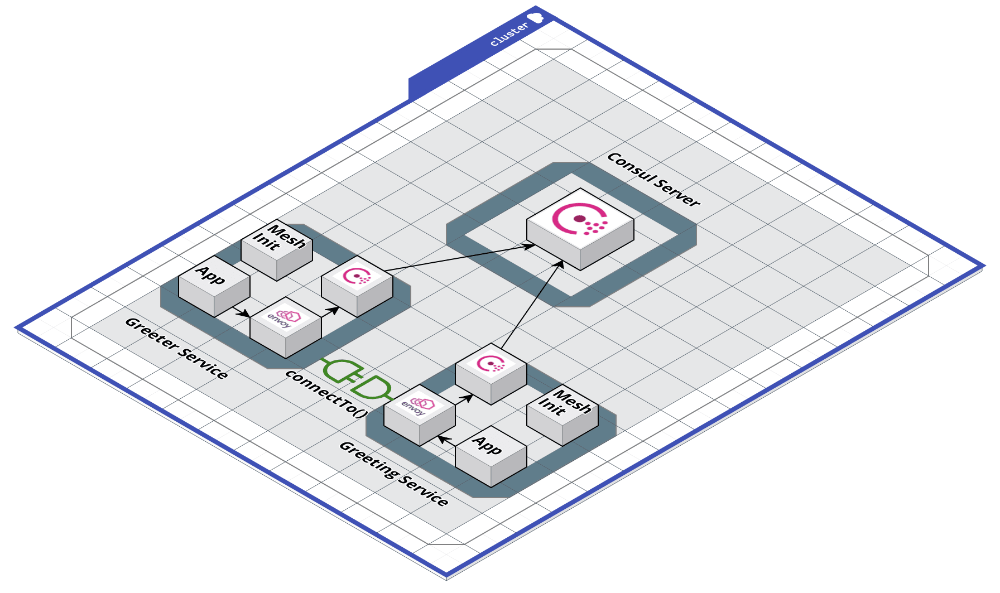

# CDK ECS service extension for Consul

This repo provides CDK service extension to deploy consul service mesh on ECS.

## Background
Currently,in order to create services using CDK stack that joins [consul service mesh](https://www.consul.io/docs/connect) we need [ever growing monolithic collection of code](https://github.com/aws-samples/amazon-ecs-fargate-consul-connect-example). Every time when customer needs to add their services to the consul service mesh they need to configure sidecars such as proxy container and agent container in the same VPC as consul connect lives. Creating these sidecars for every new service creates an overhead on customers to allow their services to join service mesh. 

## Goals
The goal here is to allow services to join consul service mesh by configuring envoy proxy, consul agent and mesh-init sidecars as a part of consul connect extension. Customers will only give their application code and few more configurations such as cpu, consul server security group, TLS and Gossip secrets, and everything else will take care by the ECS Consul Mesh extension

## Architecture
Every service in the mesh will have four containers i.e. Application container, Envoy Proxy container, Consul Client container, and Mesh Init container




Terms / Glossary 

*Consul Server -* The Consul Servers take care of collecting information about service health, service location, service availability and perform calculations like service resolution, certificate signing etc. They are also the central point of configuration for things like the Service Access Graph (Intentions) or Layer 7 traffic management features, which are then provided to the respective Consul clients.

*Consul Client Agent -* Consul clients take care of tasks which are distributed across the control-plane such as the generation of key material for service certificates, health checking of services, and configuring sidecar proxy instances.

*Envoy Proxy -* Proxies form what is referred to as the "data plane": the pathway which data travels for network connections.For the production ready extension we will be using envoy proxy which will handle actual packet forwarding. 

*Service Mesh -* Service mesh is a dedicated infrastructure layer for facilitating service-to-service communications between services or micro services.

*Application Container* - Application container will have application code and configurations required for the application to work


In order to explain how ECS Consul Service Mesh works please go through the [greeter application](https://github.com/aws-samples/amazon-ecs-fargate-consul-connect-example/tree/main/cdk)

### Example

```
import { ECSConsulMeshExtension, RetryJoin } from '@aws-quickstart/ecs-consul-mesh-extension';

const nameDescription = new ServiceDescription();
nameDescription.add(new ECSConsulMeshExtension({      
      retryJoin: new RetryJoin({ region: '$AWS_REGION', tagName: 'Name', tagValue: 'test-consul-server' }),
      port: 3000,
      consulClientSecurityGroup: consulClientSecurityGroup,
      consulServerSecurityGroup: consulServerSecurityGroup,
      consulCACert: agentCASecret,
      gossipEncryptKey: gossipSecret,
      tls: true,
      serviceDiscoveryName: 'name',
      consulDatacenter: 'dc1',
    }));
    
```